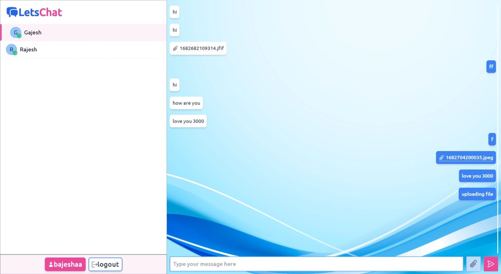
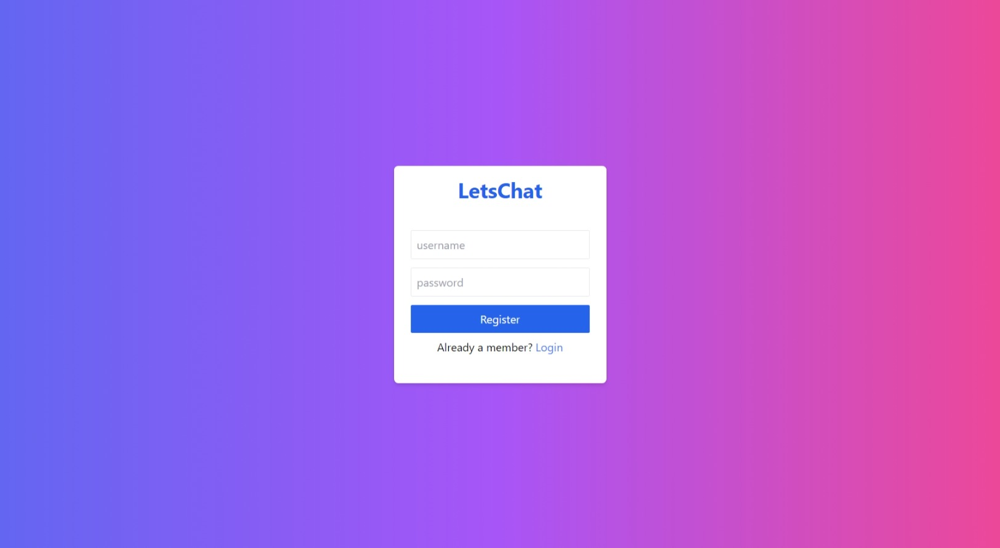

# Lets_chat
## Description :
A MERN Stack Chat Application built using WebSockets provides real-time, bidirectional communication between users. It leverages MongoDB for database management, Express.js for server-side operations, React.js for building the user interface, and Node.js for running JavaScript on the server side.

## Installation :
1. Clone the repository
2. Install dependencies for both client and server side
-  open the terminal and change directory to server and run command
```
npm install
```
- open the terminal and change directory to client and run command
```
npm install
```
3. Run the application
- run server command:
```
npm run dev
```
- run client command:
```
npm run dev
```
4. Open http://localhost:5173 to view it in the browser.

## Snapshots 



